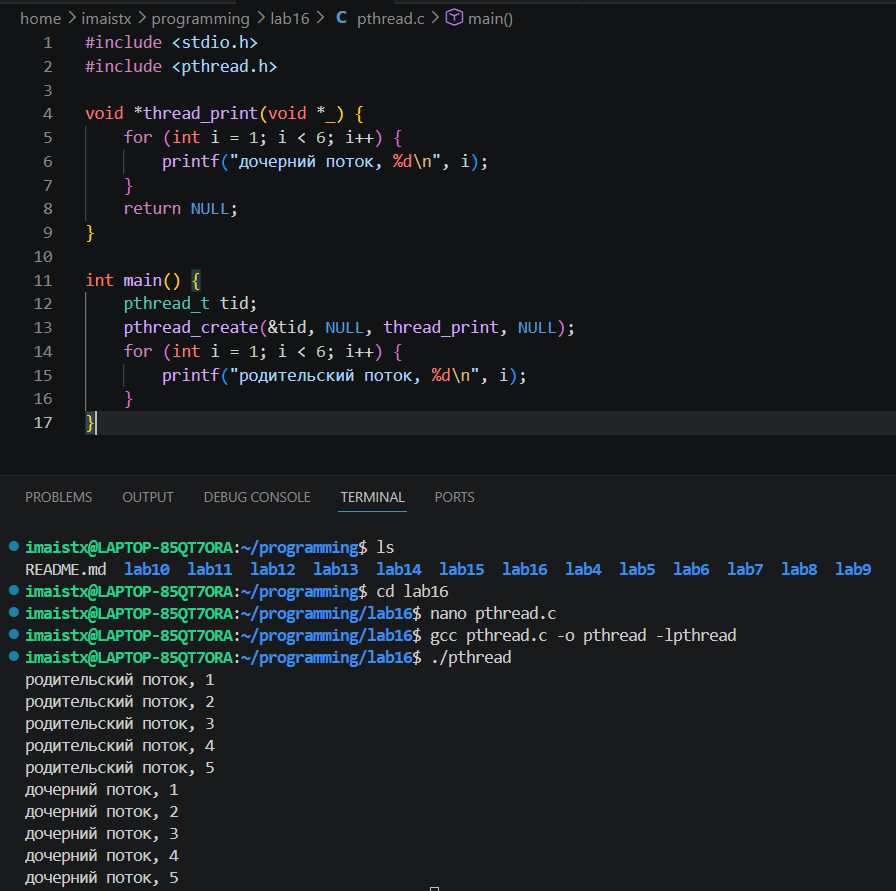
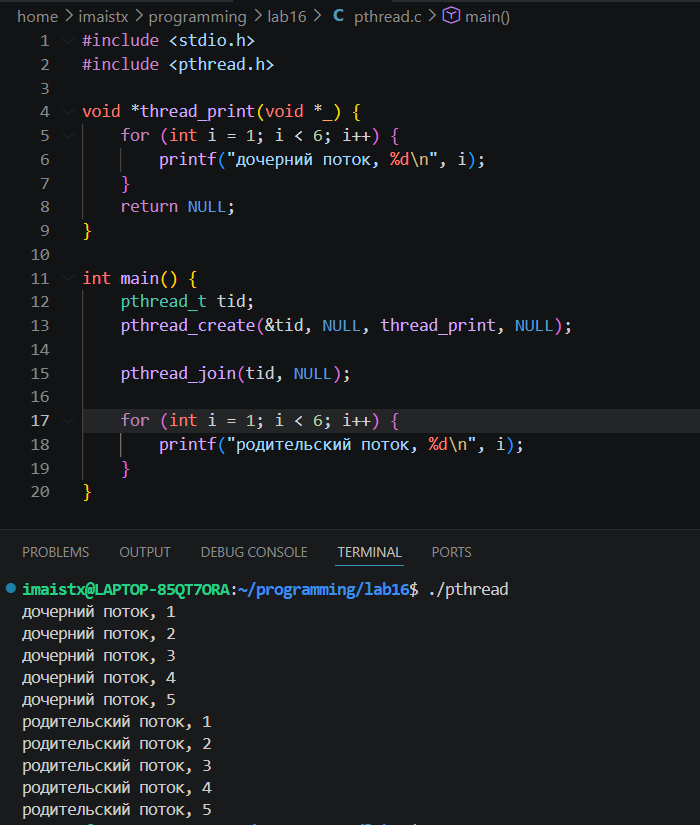
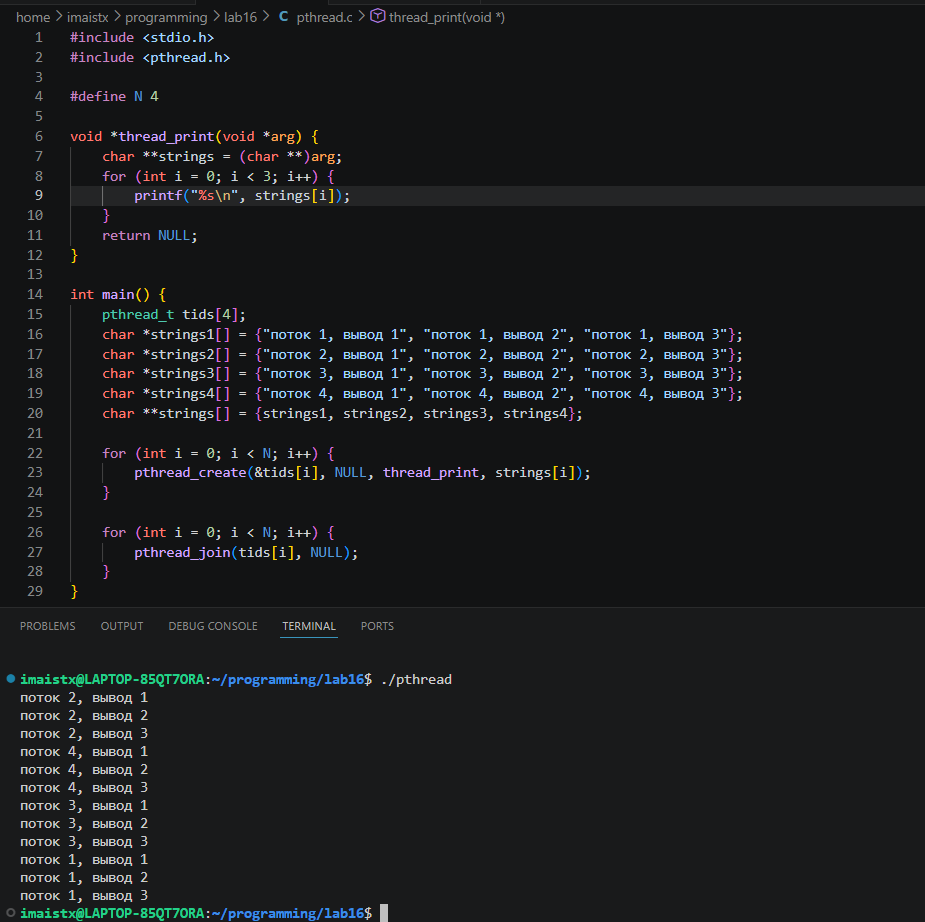
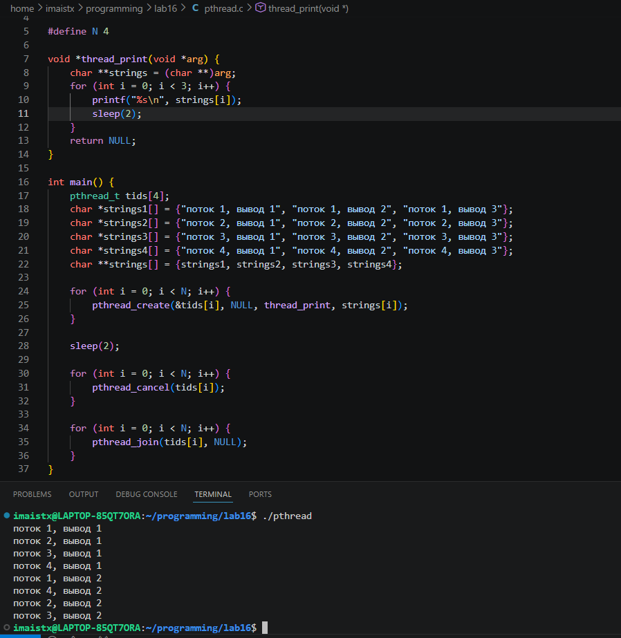
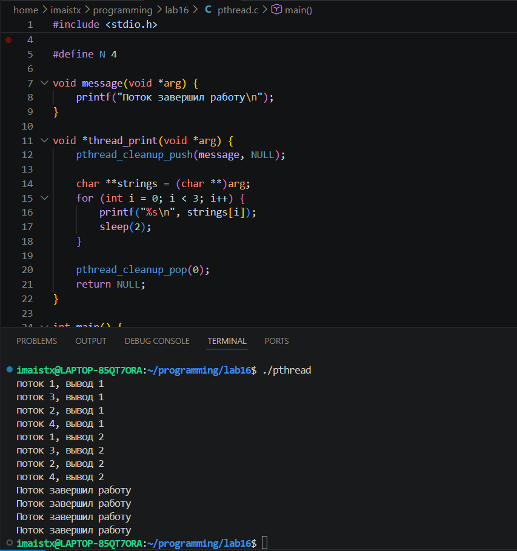
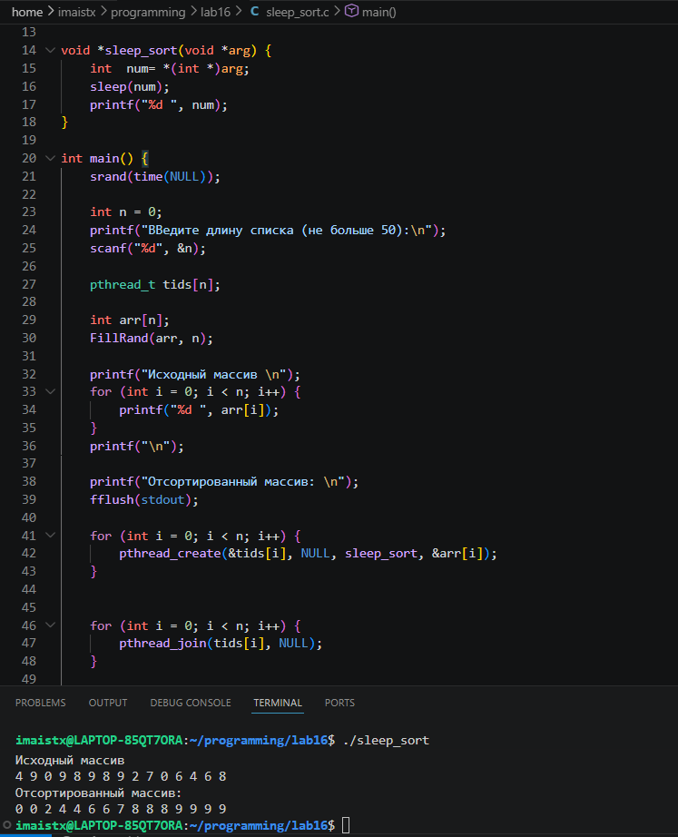

# Лабораторная работа #16
Задание на 3

Программа, которая создает поток с помощью pthread_create(), атрибуты по умолчанию. 
Родительский и дочерний потоки выводят на экран по 5 строк текста.
 
 
Чтобы родительский поток выводил текст после дочернего, был добавлен pthread_join:
 

Далее программа была модифицирована: основной поток создает 4 потока, 
исполняющих одну и ту же функцию. Эта функция печатает последовательность текстовых строк, переданных как параметр. 
Каждый из созданных потоков печатает различные последовательности строк. 
 
 
Был добавлен сон с помощью sleep() в функцию потоков между выводами строк. 
Спустя две секунды после создания дочерних потоков основной поток прерывает работу всех дочерних потоков с помощью pthread_cancel(). 
 
 
Далее был использован pthread_cleanup_push(), чтобы дочерний поток перед завершением распечатывал сообщение об этом.
 

Реализован алгоритм сортировки Sleepsort с асимптотикой O(N) (по времени). Суть алгоритма: на вход подается массив не более 50 целочисленных значений.
Для каждого элемента массива создается отдельный поток, в который в качестве аргумента передается значение элемента. Сам поток уходит в сон с 
помощью sleep() с параметром равным аргументу потока (значение элемента массива). 
 